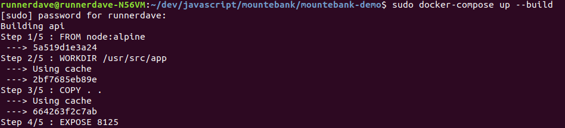
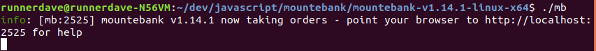
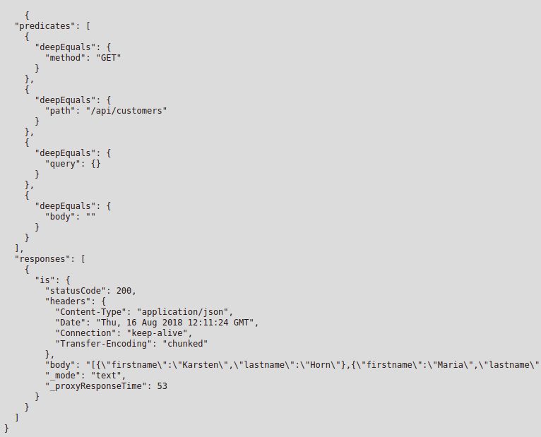

# About imposters and doubles

Well into the project, with the deadline looming,in the middle of the sprint, and you have half or more of your team browsing the internet because some upstream system is down and no development/testing/showcase can be done.

If you are part of a high performant team, that have all their microservices architecture and pipelines working this kind of problem probably does not occur to you. 

But to most of us it does.

All the time.

You may actually have already tried _stubbing_(or _mocking_) some or all of your upstream endpoints but there is always a case that you haven't thought or it is too hard to recreate with a _stub_(_mock_).

(In case you did not understand, or are vaguely familiar with, the last paragraph, _stubs_ or _mocks_ are simple versions of your complex backends that allow your team to keep working towards the project goals even when your backend is down.)

_Mocks_ and _stubs_, more generally: __test doubles__, also are very useful in the early stages of the project when you have a team of developers but neither the requirements nor the design are yet complete and you don't want to waste their valuable hourly rates but instead let them help in the initial contracts of the application.

So a very common approach is to create dummy servers that respond to specific requests. For example an end point that returns with a fixed address that can act as a __double__ for an address lookup in your form.

This traditional approach involves some work with a stubbing framework or a simple webserver for which a developer prepares a suite of fixed responses.

A common tool that allows this is __stubby4j__ (https://github.com/azagniotov/stubby4j). This is a standalone jar (with Jetty inside) that allows to write your responses to your mock endpoints in yml.

This can be a good start, however each response needs to be crafted carefully by hand, limiting the ability to produce realistic responses, only simple ones. So most likely this method won't scale with your project development lifecycle.

Enter [__Mountebank__](http://www.mbtest.org).

Mountebank is a nice tool that allows to create your responses proxying your real backend and then saving all the responses for automatic replaying.

So basically you tell Mountebank the address of your backend and point your application to the Mountebank address. Then ask your testers/business analysts/developers to use your application as per normal, and then you can switch your backend off, creating an _imposter_.

The more you use __Mountebank__ as a proxy to your application the better your _Imposter_ will be.

Forget about asking a developer to craft manually hundreds of lines of potential responses or worse multiline RegExps that nobody would like to maintain.

How to use it then?

The documentation on their site is very nice, but it assumes a lot of knowlegde, so for the remainder of this article, I will show how to set it up with a sample API and also compare it with stubby4j.

## hands on stuff

To continue with the article clone/fork the following repo: https://github.com/runnerdave/mountebank-demo

You will also need:

* Mountebank (download from: http://www.mbtest.org/docs/install the option for _Self-contained archives_ choosing your platform from the list)
* Docker (https://www.docker.com/)
* cURL installed in your terminal
* Java (optional, for stubby4j only)
* NodeJS (optional, if you don't want to use Docker)
* [Postman](http://getpostman.com) (optional)

Assuming you have cloned the repo to the following location:

````
runner-box:~/projects/mountebank-demo$
````

and downloaded and expanded Mountebank to this location (linux example):

````
runnerdave@runnerdave-N56VM:~/dev/javascript/mountebank/mountebank-v1.14.1-linux-x64$
````

Then from your _mountebank-demo_ location run docker-compose:


And start Mountebank:


Now you are ready to create your first __Impostor__:

````
curl -i -X POST -H 'Content-Type: application/json' http://127.0.0.1:2525/imposters --data '{
  "port": 6569,
  "protocol": "http",
  "name": "proxyOnce",
  "stubs": [
    {
      "responses": [
        {
          "proxy": {
            "to": "http://localhost:8125",
            "mode": "proxyOnce",
            "predicateGenerators": [
              {
                "matches": {
                  "method": true,
                  "path": true,
                  "query": true,
                  "body": true
                }
              }
            ]
          }
        }
      ]
    }
  ]
}'
````

then hit the following endpoint in your browser: http://localhost:6569/api/customers

and compare it with the api response directly: http://localhost:8125/api/customers 

you can notice they are equivalent.

Now you can see your imposters here:
http://localhost:2525/imposters/6569

you should see the following:


Then hit the following POST endpoint via cURL (or Postman):
````
curl -X POST \
  http://localhost:6569/api/create-customer \
  -H 'Cache-Control: no-cache' \
  -H 'Content-Type: application/json'
  -d '{"firstname": "Maria","lastname": "Sharapova"}'
````

This would have created another imposter that you can inspect using the same url as before.

And here is where the magic happens: stop your docker container ([ctrl]+c), and hit your previous endpoints again, and they should reply as before.

You can also save this run with the following call (ensure mountebank is still running): 

````
.../mountebank-v1.14.1-linux-x64$ ./mb save --savefile impostorsForSimplestPossibleAPI.json
````

You can stop Mountebank now (([ctrl]+c)) and start it with the reference to the previous file:

````
.../mountebank-v1.14.1-linux-x64$ ./mb --configfile impostorsForSimplestPossibleAPI.json
````


### Further reading and references

* Martin Fowler, [_Mocks aren't stubs_](https://martinfowler.com/articles/mocksArentStubs.html#TheDifferenceBetweenMocksAndStubs)
  
* Otávio Machado, [_Using Mountebank to stub external dependencies_](https://hackernoon.com/using-mountebank-to-stub-external-dependencies-step-by-step-5f0a6b30d8de)

* Mountebank stubs (http://www.mbtest.org/docs/api/stubs)