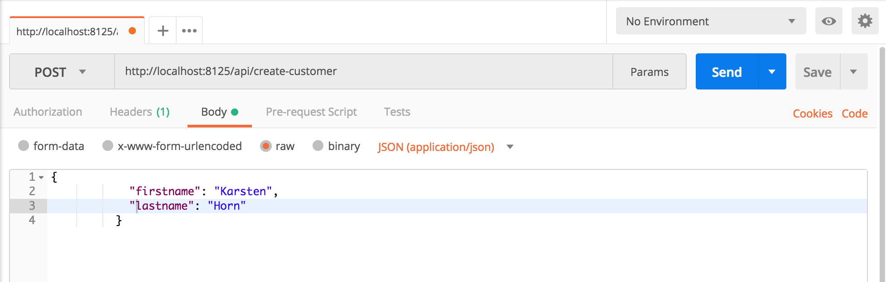
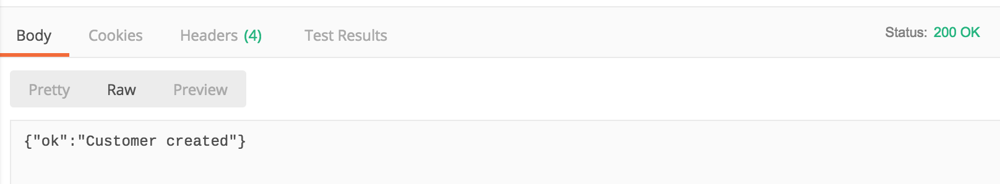

# Using Mountebank

Demo code for the usage of mountebank: http://www.mbtest.org/

## Introduction

Mountebank is an open source tool that allows to run multi-protocol test doubles.

This demo will allow to stand up a simple application then record some tests and replay them with mountebank.

Read this article for instructions on how to use this repo with Mountebank: https://medium.com/p/9f252b7b4a7a/
(locally: [article](blog-post.md))

The goal of the article is to stand up an api and record some hits to its endpoints with Mountebank 
as a proxy, then shut down the api and hit the endpoints using Mountebank port and see how Mountebank
has created an imposter for the original api.

### Installing pre-requisites

#### Installing mountebank

*   Download the option you need depending on your OS from http://www.mbtest.org/docs/install look at the links for the option: _Self-contained archives_
````
$ wget --no-check-certificate https://s3.amazonaws.com/mountebank/v1.14/mountebank-v1.14.1-darwin-x64.tar.gz
````
*   Expand the downloaded file wherever you will be using it
````
$ tar -xvf mountebank-v1.14.1-darwin-x64.tar.gz
````
*   Navigate to the directory and execute the script
````
runnerdave-mac:mountebank-v1.14.1-darwin-x64 p766894$ ./mb
info: [mb:2525] mountebank v1.14.1 now taking orders - point your browser to http://localhost:2525 for help
````

#### Installing Stubby4J (optional)
*   source at: https://github.com/azagniotov/stubby4j.
*   navigate to the stubby4j directory of this repo and run the following command:

````bash
$ java -jar stubby4j-6.0.1.jar -d hello-world-config.yml
````
Your endpoints are:
*   GET: http://localhost:8882/hello-world
*   POST: http://localhost:8882/create-customer

#### Installing Postman
You can install it as a chrome app, but they advice that this method will be deprecated in the near future, so it would be recommended to install natively.
*   chrome app: [chrome web app](https://chrome.google.com/webstore/detail/postman/fhbjgbiflinjbdggehcddcbncdddomop?hl=en) 
*   native app: https://www.getpostman.com/apps

With Postman you can create GET or POST requests to the endpoints describe below in this article, if you prefer not to use cURL.

For example, once you have the api from this repo running locally on port 8125, you can create a POST request like it is shown in this image:



Paste a JSON customer like the one shown and If you press the "SEND" button, you should see the following response:



### Contents of the repository

*   __form/server.js__: __nodeJS__ server that presents a local form , taken from: https://stackoverflow.com/questions/15427220/how-to-handle-post-request-in-node-js#19183959
    *   method GET: 
        http://localhost:8124/
        Presents a simple form with few fields and a submit button
    *   http://localhost:8124/favicon.ico
        If hit directly, this endpoint returns a 404 status error
    *   method POST:
        http://localhost:8124/inbound
        This endpoint handles the previous form submission displaying the values submitted and a thank you message.
    *   any other method returns a 405 status code error

* __api/api.js__: also a simpler nodeJS set of endpoints to allow interactions to practice with Mountebank.
    *   http://localhost:8125/api/customers
        Returns a fixed json object with two customers to be used via a simple GET request.
    *   http://localhost:8125/api/create-customer
        Receives a POST request and returns a json object with the success message
    *   http://localhost:8125/
        Displays a simple html page

*   __Dockerfile__: image to run server.js in [Docker](https://www.docker.com/)


### running the app

1.   without installing __nodeJS__ and using __docker-compose__

```docker-compose up --build```

This installs and exposes the two different applications described in the Contents section

1.  if you don't have/want to use docker and have __nodeJS__ installed:

*   Start the form application:
    *   Navigate to the ./form directory
    *   run: ```node server.js```

*   Start the api application:
    *   Navigate to the ./api directory
    *   run: ```node api.js```
    

## References

*   Martin Fowler, Mocks Aren't Stubs https://martinfowler.com/articles/mocksArentStubs.html
*   Medium article: https://medium.com/p/9f252b7b4a7a/
